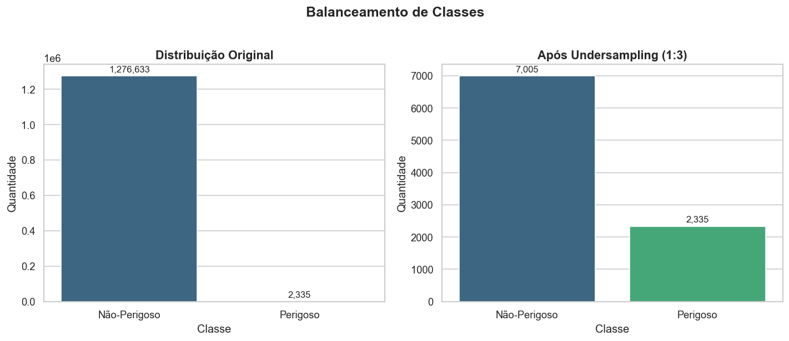
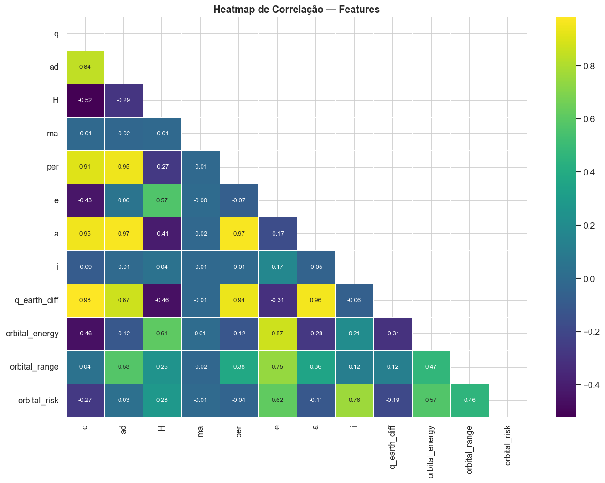
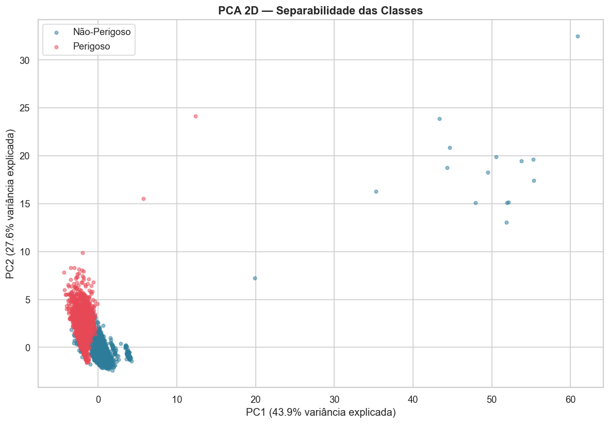
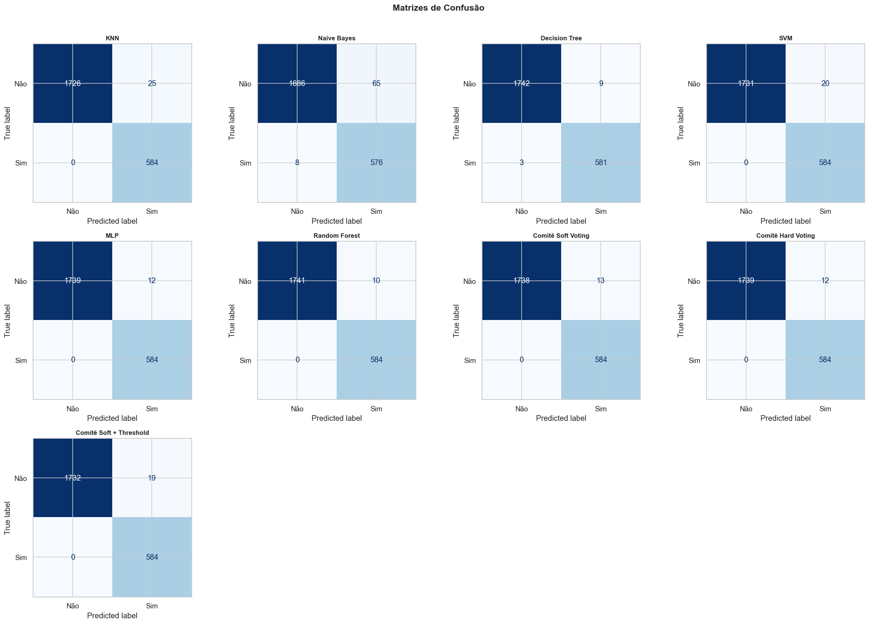
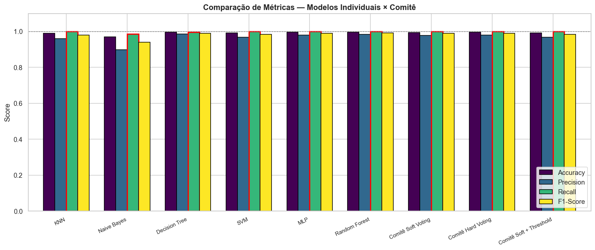
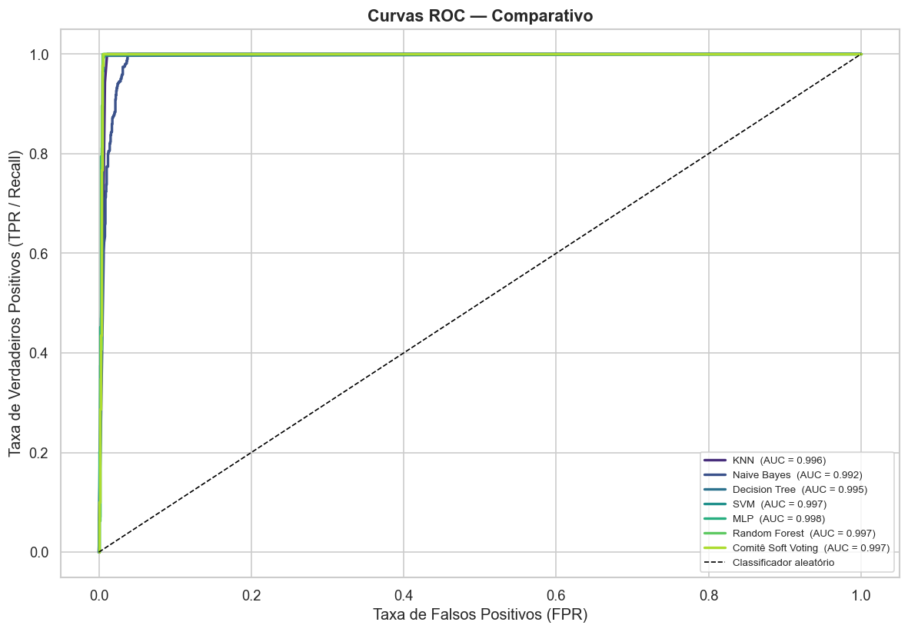
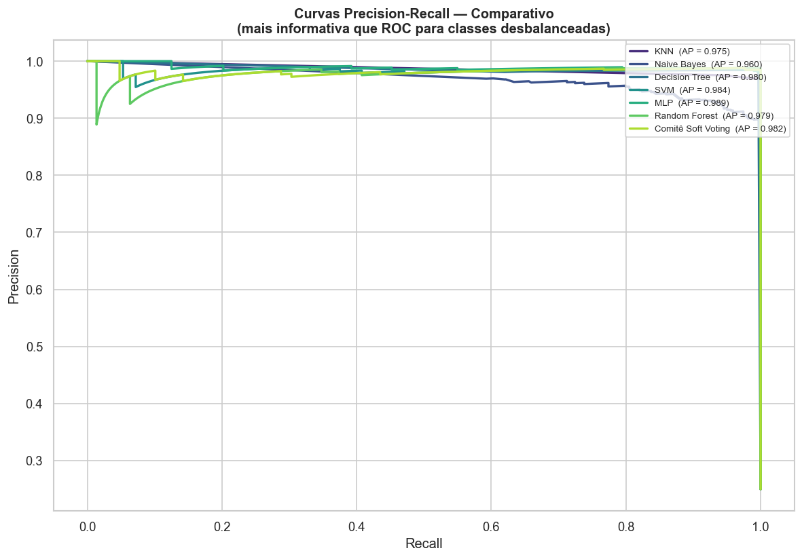
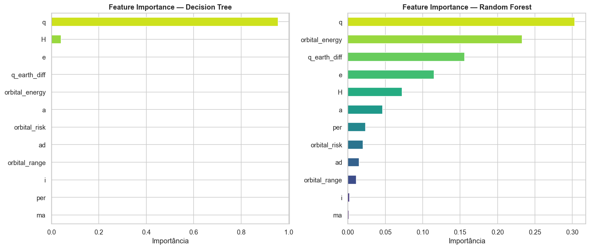

# Comitê de Classificadores para Asteroides Potencialmente Perigosos (PHA)

<div align="center">

[](https://python.org)
[](https://scikit-learn.org/)
[](https://pandas.pydata.org/)
[](https://numpy.org/)
[](https://threejs.org/)

</div>

## 📌 Sobre o Projeto

Este é o projeto **A3 de Inteligência Artificial**, um sistema de **classificação supervisionada** capaz de prever se um asteroide deve ser considerado **potencialmente perigoso** para a Terra — os chamados **PHA** (*Potentially Hazardous Asteroids*).

O projeto utiliza dados reais do **[NASA JPL Small-Body Database](https://ssd.jpl.nasa.gov/tools/sbdb_query.html)** e aplica um fluxo completo de Machine Learning: pré-processamento, engenharia de features orbitais com justificativa física, balanceamento de classes, treinamento de **seis classificadores** e a construção de um **comitê de classificadores** (*ensemble* via *Voting*).

O problema foi formulado como uma **classificação binária**:

* **`1`** → asteroide potencialmente perigoso (PHA)
* **`0`** → asteroide não perigoso

> ⚠️ **Decisão de projeto:** como a base é fortemente desbalanceada (muito mais asteroides seguros do que perigosos), o pipeline prioriza o **recall** em vez da acurácia bruta. Um **falso negativo** aqui significa deixar passar um asteroide perigoso — o erro mais crítico possível neste domínio. Por isso o comitê usa *threshold tuning* para reduzir esse risco.

## 🏗️ Arquitetura e Fluxo de Dados

O pipeline é totalmente modular: cada responsabilidade vive em um módulo próprio dentro de `src/`, e o `main.py` apenas orquestra a ordem de execução. O fluxo completo é:

```text
sbdb_asteroides.csv
        │
        ▼
┌───────────────────┐   carregamento.py
│  1. Carregamento  │   • Leitura do CSV + EDA básico
└───────────────────┘
        │
        ▼
┌───────────────────┐   preprocessamento.py
│ 2. Pré-process.   │   • Encoding do target (Y→1 / N→0)
│    + Feature Eng. │   • Imputação por mediana
└───────────────────┘   • 4 features orbitais derivadas
        │
        ▼
┌───────────────────┐   balanceamento.py
│ 3. Balanceamento  │   • Undersampling (proporção 1:3)
└───────────────────┘
        │
        ▼
┌───────────────────┐   preprocessamento.py
│ 4. Split + Escala │   • 75% treino / 25% teste (estratificado)
└───────────────────┘   • StandardScaler
        │
        ▼
┌───────────────────┐   modelos.py
│ 5. Classificadores│   • Treina os 6 modelos individuais
└───────────────────┘
        │
        ▼
┌───────────────────┐   ensemble.py
│ 6. Comitê (Voting)│   • Soft Voting + Hard Voting
│    + Threshold    │   • Threshold tuning (0.35) para recall
└───────────────────┘
        │
        ▼
┌───────────────────┐   avaliacao.py + visualizacoes.py
│ 7. Avaliação      │   • Métricas, curvas ROC/PR, validação cruzada
│    + Visualização │   • Exporta CSV e gráficos PNG
└───────────────────┘
        │
        ▼
   outputs/ + reports/apresentacao_a3.html
```

### Etapas detalhadas

1. **Carregamento (`carregamento.py`)** — Lê o dataset `sbdb_asteroides.csv` e executa uma análise exploratória básica (dimensões, tipos, valores ausentes, distribuição do alvo).
2. **Pré-processamento + Engenharia de Features (`preprocessamento.py`)** — Codifica o target (`Y → 1`, `N → 0`), remove linhas sem rótulo e imputa valores ausentes pela **mediana** (robusta a outliers astronômicos). Em seguida cria **4 features orbitais derivadas**, cada uma com justificativa física:
   * `q_earth_diff` → proximidade do periélio à órbita da Terra (`|q − 1.0|`)
   * `orbital_energy` → proxy de energia orbital (`e / a`)
   * `orbital_range` → amplitude da órbita (`ad − q`)
   * `orbital_risk` → órbitas "desviantes" do plano eclíptico (`e × i`)

   > As colunas `moid` e `neo` foram **deliberadamente excluídas** por causarem *data leakage* direto sobre o target.
3. **Balanceamento (`balanceamento.py`)** — Aplica *undersampling* da classe majoritária para uma proporção **1:3** (negativos = 3 × positivos), reduzindo o viés do modelo para a classe dominante.
4. **Split + Escalonamento (`preprocessamento.py`)** — Divisão **estratificada** em 75% treino / 25% teste e padronização com **`StandardScaler`** (essencial para KNN, SVM e MLP, que são sensíveis à escala).
5. **Classificadores individuais (`modelos.py`)** — Treina os seis modelos base (ver tabela abaixo).
6. **Comitê de Classificadores (`ensemble.py`)** — Combina os modelos via **`VotingClassifier`** em duas estratégias (*soft* e *hard*) e aplica **threshold tuning** (corte em `0.35` em vez de `0.50`) para maximizar o recall.
7. **Avaliação e Visualização (`avaliacao.py`, `visualizacoes.py`)** — Calcula métricas, curvas ROC e Precision-Recall, faz validação cruzada, exporta o relatório em CSV e gera todos os gráficos PNG.

## 🤖 Modelos Implementados

| Modelo | Por que foi incluído |
|---|---|
| **K-Nearest Neighbors (KNN)** | Baseado em distância; sensível à escala (requer `StandardScaler`) |
| **Gaussian Naive Bayes** | Probabilístico; assume independência entre features |
| **Decision Tree** | Baseado em regras; interpretável, porém de alta variância |
| **Support Vector Machine (SVM)** | Margem máxima; eficaz em espaços de alta dimensão (`probability=True` para soft voting) |
| **Multi-Layer Perceptron (MLP)** | Rede neural que captura não-linearidades |
| **Random Forest** | Ensemble de árvores; reduz a variância da Decision Tree |

E três estratégias de **comitê**:

* **Soft Voting** — combina a *confiança* (probabilidade) de cada modelo
* **Hard Voting** — votação majoritária pelo rótulo final
* **Soft Voting + Threshold** — soft voting com corte ajustado para `0.35` (prioriza recall)

> **Por que Soft Voting?** Ele pondera modelos inseguros (probabilidade próxima de 0.5) com menos peso — ideal quando os classificadores têm desempenho heterogêneo (ex.: Naive Bayes vs. MLP).

## 📊 Resultados Principais

| Modelo | Accuracy | Precision | Recall | F1-Score |
|---|---:|---:|---:|---:|
| KNN | 0.9893 | 0.9589 | 1.0000 | 0.9790 |
| Naive Bayes | 0.9687 | 0.8986 | 0.9863 | 0.9404 |
| Decision Tree | 0.9949 | 0.9847 | 0.9949 | 0.9898 |
| SVM | 0.9914 | 0.9669 | 1.0000 | 0.9832 |
| MLP | 0.9949 | 0.9799 | 1.0000 | 0.9898 |
| Random Forest | 0.9957 | 0.9832 | 1.0000 | 0.9915 |
| **Comitê Soft Voting** | 0.9944 | 0.9782 | 1.0000 | 0.9890 |
| **Comitê Hard Voting** | 0.9949 | 0.9799 | 1.0000 | 0.9898 |
| **Comitê Soft + Threshold** | 0.9919 | 0.9685 | 1.0000 | 0.9840 |

> 🎯 **Destaque:** o **recall igual a 1.0** nos modelos com *voting* indica que **nenhum PHA do conjunto de teste passou despercebido** — exatamente o objetivo de um sistema de alerta de risco.

## 🖼️ Visualizações Geradas

O pipeline gera automaticamente os seguintes gráficos em `projeto_a3/outputs/figures/`:

| Distribuição da variável alvo | Heatmap de correlação |
|---|---|
|  |  |

| PCA 2D | Matrizes de confusão |
|---|---|
|  |  |

| Comparação de métricas | Curvas ROC |
|---|---|
|  |  |

| Curvas Precision-Recall | Importância de features |
|---|---|
|  |  |

## 🪐 Apresentação Final Interativa

O entregável final é uma apresentação web **autocontida**, em estilo PowerPoint, localizada em:

```text
projeto_a3/reports/apresentacao_a3.html
```

Ela inclui:

* **13 slides** com gráficos embutidos
* Tema visual espacial
* **Simulação 3D interativa** com [Three.js](https://threejs.org/)
* Navegação por teclado e controles interativos da simulação

## 🛠️ Tecnologias Utilizadas

* **Linguagem:** Python 3.12
* **Machine Learning:** scikit-learn
* **Manipulação de Dados:** pandas, NumPy
* **Visualização:** Matplotlib, Seaborn
* **Apresentação Web:** HTML, CSS, JavaScript e Three.js (simulação 3D)

## 📂 Estrutura do Repositório

```text
projeto_a3/
├── main.py                       # Orquestrador do pipeline completo
├── requirements.txt              # Dependências do projeto
├── src/                          # Lógica modular do pipeline
│   ├── config.py                 # Constantes centrais (paths, seeds, thresholds)
│   ├── carregamento.py           # Leitura do CSV + EDA básico
│   ├── preprocessamento.py       # Limpeza, imputação e feature engineering
│   ├── balanceamento.py          # Undersampling da classe majoritária
│   ├── modelos.py                # Definição e treino dos 6 classificadores
│   ├── ensemble.py               # Comitê (Voting) + threshold tuning
│   ├── avaliacao.py              # Métricas, curvas ROC/PR e validação cruzada
│   └── visualizacoes.py          # Geração dos gráficos PNG
├── data/
│   └── raw/                      # Dataset bruto (sbdb_asteroides.csv)
├── outputs/
│   ├── figures/                  # Gráficos gerados pelo pipeline
│   ├── metrics/                  # relatorio_metricas.csv
│   └── logs/                     # Logs (ex.: top5_asteroides_risco.csv)
├── reports/                      # Apresentação HTML, relatório e documentação
│   ├── apresentacao_a3.html
│   ├── Relatorio_A3.pdf
│   └── Documentacao_Projeto_A3.pdf
└── notebooks/
    └── 01_eda.ipynb              # Prototipação e análise exploratória
```

## ⚙️ Parâmetros de Configuração

Todos os parâmetros do pipeline são centralizados em `src/config.py` — qualquer ajuste deve ser feito **apenas ali**:

| Parâmetro | Valor | Descrição |
|---|---|---|
| `RANDOM_STATE` | `42` | Semente para reprodutibilidade |
| `TEST_SIZE` | `0.25` | Proporção do conjunto de teste |
| `UNDERSAMPLE_RATIO` | `3` | Negativos = 3 × positivos (proporção 1:3) |
| `ENSEMBLE_THRESHOLD` | `0.35` | Corte de probabilidade para priorizar recall |

## 🚀 Como Executar o Projeto

### Pré-requisitos

* [Python 3.12+](https://www.python.org/downloads/)
* `pip` (gerenciador de pacotes)

### Passo a Passo

**1. Clone o repositório e entre na pasta do projeto**
```bash
git clone <url-do-repositorio>
cd AI/projeto_a3
```

**2. (Opcional) Crie um ambiente virtual**
```bash
python -m venv .venv
# Windows
.venv\Scripts\activate
# Linux / macOS
source .venv/bin/activate
```

**3. Instale as dependências**
```bash
pip install -r requirements.txt
```

**4. Execute o pipeline completo**
```bash
python main.py
```

Ao final da execução, o pipeline gera:

```text
outputs/figures/                       → gráficos PNG
outputs/metrics/relatorio_metricas.csv → tabela comparativa de métricas
```

**5. Abra a apresentação final**

Abra o arquivo `reports/apresentacao_a3.html` em qualquer navegador moderno para ver os slides e a simulação 3D interativa.

## 👥 Integrantes

| Nome | RA |
|---|---:|
| Matheus Santos Morais Arruda | 825218417 |
| Lucca Campello Rodrigues dos Santos | 82525684 |
| Jorge Antonio de Paula Tosi | 825220685 |
| Guilherme Caposse Tabler | 825126059 |
| Matheus Miano | 82425432 |

## ✅ Conclusão

O projeto demonstra que modelos clássicos de Machine Learning, quando combinados com **pré-processamento adequado**, **balanceamento** e **engenharia de features com fundamentação física**, alcançam alto desempenho na classificação de asteroides potencialmente perigosos.

O uso de **comitês de classificadores** aumentou a confiabilidade da predição — especialmente no **recall**, a métrica mais crítica para garantir que nenhum asteroide perigoso passe despercebido.
</content>
</invoke>
